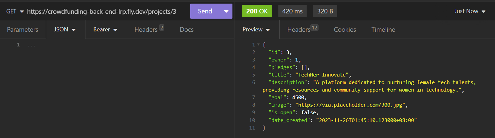
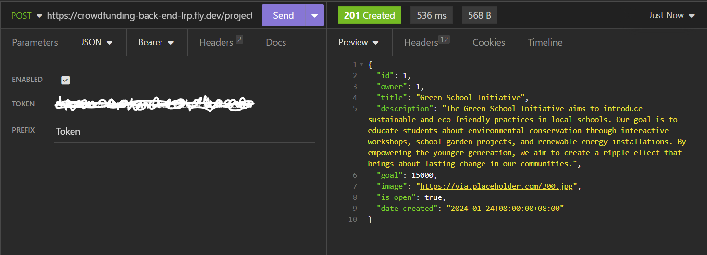

# Crowdfunding Back End
Lanie Ruiz-Perez
## Planning:
### Concept/Name
Welcome to FundASSISTa: Empowering Connections for Social Change
FundASSISTa is a dynamic platform dedicated to fostering impactful connections between donors, investors, and a spectrum of women-led, socially-responsible causes and entrepreneurial ideas. Our mission is to create a vibrant ecosystem where financial support meets visionary leadership, catalyzing positive societal transformations.
### Intended Audience
- Visionary Women Leaders: At the heart of our platform are women spearheading innovative projects and initiatives aimed at social betterment. FundASSISTa provides them with the visibility and support needed to turn their ideas into reality.
- Committed Donors: Individuals seeking to make a difference will find a curated selection of projects that align with their values, ensuring their contributions have a meaningful impact.
- Strategic Investors: Investors looking for opportunities that offer not just financial returns but also contribute to social progress will find a diverse range of ventures to support, each led by forward-thinking women.
### User Stories
- As a socially-conscious donor, I want to find and contribute to women-led initiatives that align with my values, so that I can be part of meaningful societal change.
- As a woman entrepreneur or leader, I need a platform where I can showcase my socially-responsible project or business idea, gain visibility, and attract funding from donors and investors who are committed to supporting women-led initiatives.
- As a philanthropic organization, we seek a platform that curates a diverse range of high-impact, women-led projects, allowing us to efficiently allocate our funds to causes that align with our mission of empowering women and driving social change.
- As a corporate sponsor, we are looking for opportunities to support and collaborate with women-led, socially-responsible projects as part of our corporate social responsibility strategy, enhancing our brand's commitment to gender equality and social impact.
- As a social impact investor, I need a trustworthy and transparent platform where I can discover and invest in promising women-led ventures that not only promise a financial return but also contribute significantly to social good.
- As a user interested in social change, I want to explore a variety of projects and ideas led by innovative women, learn about their impact, and have the option to support them through donations or investments.

## Deployed project
The deployed project is available at https://crowdfunding-back-end-lrp.fly.dev/ 

### Example of a successful GET method

Admin user can retrieve any project given its project_id..

### Example of a successful POST method

Admin user can create new project

### API Specifications
Full details of the API specifications can be found in the document images/DFR_APIspecs.pdf
